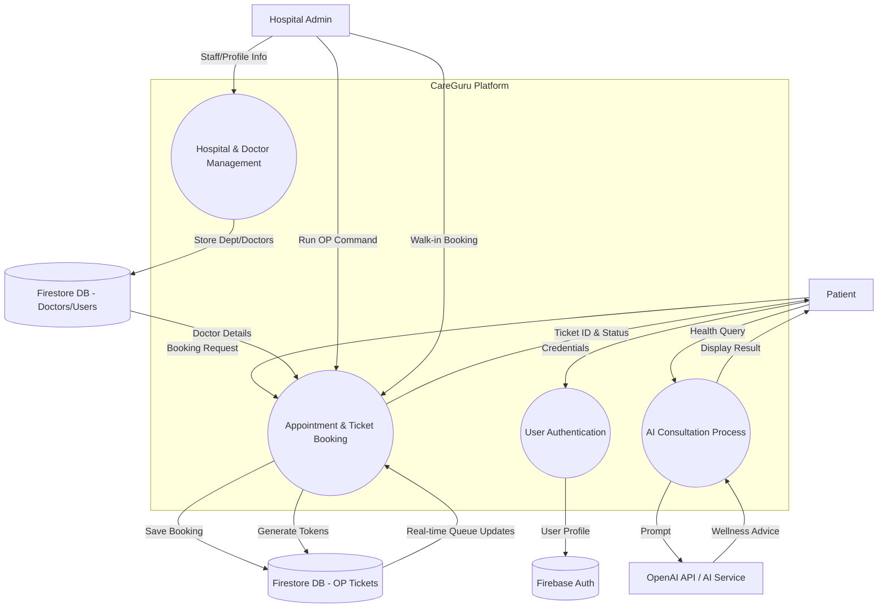

# CareGuru - Project Diagrams

This document contains the **Use Case Diagram** and **Data Flow Diagram (DFD)** for the CareGuru medical application, accurately reflecting the functionality implemented in the code.

## 1. Use Case Diagram

The Use Case Diagram illustrates the functional requirements of the system from the perspective of different actors (Patient, Hospital Admin, and AI Assistant).

```mermaid
useCaseDiagram
    actor Patient
    actor "Hospital Admin" as Admin
    actor "AI Assistant" (LLM) as AI

    package "CareGuru System" {
        usecase "Register / Login" as UC1
        usecase "Search Hospitals" as UC2
        usecase "View Hospital/Doctor Details" as UC3
        usecase "Book OP Ticket / Appointment" as UC4
        usecase "Make Online Payment" as UC5
        usecase "View Personal Appointment History" as UC6
        usecase "Consult AI Medical Assistant" as UC7
        usecase "Manage Hospital Profile" as UC8
        usecase "Manage Doctor Listings (Add/Edit/Delete)" as UC9
        usecase "Update Doctor Patient Capacity" as UC10
        usecase "Generate Daily Queue (Run OP)" as UC11
        usecase "Process Walk-in Manual Booking" as UC12
    }

    Patient --> UC1
    Patient --> UC2
    Patient --> UC3
    Patient --> UC4
    Patient --> UC5
    Patient --> UC6
    Patient --> UC7

    Admin --> UC1
    Admin --> UC8
    Admin --> UC9
    Admin --> UC10
    Admin --> UC11
    Admin --> UC12

    AI -- UC7 : "Provides Wellness Advice"
```

### Actors & Use Cases Explained:
*   **Patient:** Can browse hospitals, select doctors, book appointments via an integrated payment gateway, and interact with an AI chatbot for wellness advice.
*   **Hospital Admin:** Has access to a dedicated dashboard to manage their facility's profile, onboard doctors, set their daily patient limits, and generate the daily queue for token management.
*   **AI Assistant:** A system actor (OpenAI GPT-4o-mini integrated) that provides automated responses to patient health queries.

---

## 2. Data Flow Diagram (Level 1)

The DFD shows how data moves through the system processes and where it is stored.



### Data Flow Descriptions:
1.  **Authentication Flow:** Users (Patients/Hospitals) provide credentials to the Auth process, which interacts with Firebase Auth.
2.  **Management Flow:** Hospital Admins input facility details and doctor data. This is stored in the `doctors` and `users` collections in Firestore.
3.  **Booking Flow:** Patients request appointments. The system checks doctor availability/capacity from `doctors` store and creates a record in the `opTickets` store.
4.  **AI Flow:** Patient queries are sent to the AI Consultation process, which forwards a sanitized prompt to the External AI Service (OpenAI) and returns advice to the user.
5.  **Real-time Synchronization:** The system uses Firestore's real-time listeners to ensure patients see updated ticket availability the moment a Hospital Admin changes capacity or "Runs OP".
